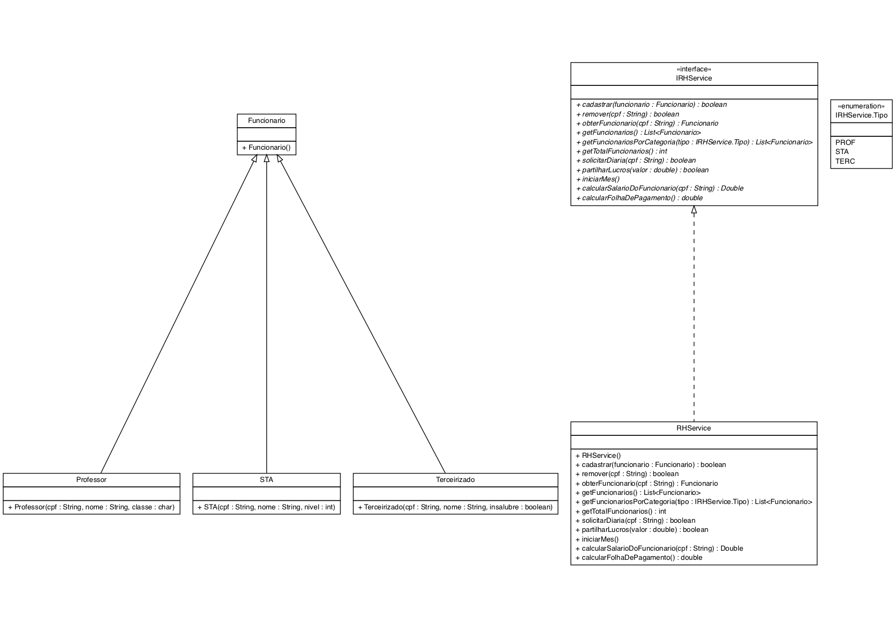

# Gestão universitária


Nesta atividade você implementará o sistema que gerencia a folha de pagamento de uma universidade.

Nessa universidade, existem tres tipos de funcionarios:
"PROF", "STA", "TERC" representando  respectivamente
professores, servidores tecnico administrativos e terceirizados.
 
Professores sao classificados em classes(A, B, C, D, E). A classe
a qual o professor pertence influencia diretamente no seu salario.
 
STAs sao classificados em niveis, que vai do 1 ate 30.O nivel influencia no salario do STA.

Terceirizados podem receber por insalubridade ou nao.

- [Requisitos](#requisitos)
- [Diagrama](#diagrama)
- [Exemplo de execução](#exemplo-de-execução)
- [Relatório de Entrega](#relatório-de-entrega)


## Requisitos

- Inserir funcionário (professor, STA, terceirizados)
  - Para inserir um funcionário é necessário informa o seu `cpf`, `nome` e `cargo`
  - Não é possível inserir funcionários com `cpfs` repetidos 
- Buscar funcionário
  - O sistema deve permitir verificar o registro de um funcionário ao informar um `cpf`
- Remover funcionário
  - Deve ser possível remover um usuário da folha de pagamento dado um `cpf` 
- Listando os funcionários
  - Deve ser possível listar todos os funcionários
  - Deve ser possível listar todos os funcionários de um determinado cargo
  - A lista deve ser ordenada de acordo como nome dos funcionários

- Participação nos lucros
  - O lucro deve ser dividido igualmente entre os funcionarios
  - Ex: Gratificacao de 500 reais. Se existirem 5 funcionarios, cada funcionario deve receber 100 reais.
- Calcular a folha de pagamento
  -  Para que o pagamento seja realizado todo funcionario deve ter
 seu `cpf` e `nome` cadastrado na folha de pagamento
  - Nessa empresa o salario ao fim dos mes e calculado da seguinte  forma:  `SalarioBase + DivisaoNosLucros + Diarias`
  - O cálculo do lucro é feito mensalmente
  - Diárias
     - **Professores** têm direito até 3 diárias
     - **STAs** têm direito a uma diárias
     - **Terceirizados** não têm direito a diáras
     - O limite de diárias é reiniciado cada mês
     - Cada diária vale 100 reias
  - Além disso exigem regras específicas para cada cargo:
      - **Professores:** Os salários variam de acordo com a classe
         - O salario das classes A, B, C, D, E são respectivamente 3000, 5000, 7000, 9000 e 11000 reais.
     - **STA:** o nível de um STA varia de 1 a 30.­
         - O salario dos STAs é calculado da seguinte forma 1000 + 100 * nivel
     - **Terceirizado:** Podem receber um adicional por insabubridade
         - O salário é 1000 sem insalubridade e 1500 com insalubridade


## Diagrama



## Exemplo de execução 
```java
public class Runner {

    public static void main(final String[] args) {


        RHService rh = new RHService();
        rh.cadastrar(new Professor("16",  "Jonas", 'C'));
        rh.cadastrar(new Professor("15", "Alessio", 'B'));
        System.out.println("Total de funcionarios = " + rh.getTotalFuncionarios()); //Total de funcionarios = 2

        rh.cadastrar(new STA("43", "Miriam", 10));
        rh.cadastrar(new STA("23", "Lacerda", 5));
        System.out.println("Total de funcionarios = " + rh.getTotalFuncionarios()); //Total de funcionarios = 4

        rh.cadastrar(new Terceirizado("12", "Carla", false));
        rh.cadastrar(new Terceirizado("78", "Adriana", true));
        System.out.println("Total de funcionarios = " + rh.getTotalFuncionarios()); //Total de funcionarios = 6

        rh.remover("12");
        System.out.println("Total de funcionarios = " + rh.getTotalFuncionarios()); //Total de funcionarios = 5
        System.out.println("Total de funcionarios = " + rh.getFuncionariosPorCategoria(IRHService.Tipo.TERC).size());

        rh.solicitarDiaria("16");
        rh.solicitarDiaria("16");
        rh.solicitarDiaria("16");
        rh.solicitarDiaria("23");
        rh.solicitarDiaria("23");

        System.out.println(rh.calcularSalarioDoFuncionario("16")); //7300.0
        System.out.println(rh.calcularSalarioDoFuncionario("23")); //1600.0
        System.out.println(rh.calcularSalarioDoFuncionario("12")); //null
        System.out.println(rh.calcularSalarioDoFuncionario("78")); //1500.0

        rh.iniciarMes();
        rh.partilharLucros(20000);

        for (Funcionario f: rh.getFuncionarios()) {
            System.out.println(f.getNome() + "(cpf=" + f.getCpf() + ") -> salario=" + f.getSalario());
        }
        //Adriana(cpf=78) -> salario=5500.0
        //Alessio(cpf=15) -> salario=9000.0
        //Jonas(cpf=16) -> salario=11000.0
        //Lacerda(cpf=23) -> salario=5500.0
        //Miriam(cpf=43) -> salario=6000.0

        System.out.println("Folha do mes = " + rh.calcularFolhaDePagamento()); //Folha do mes = 37000.0
    }
}
```


## Relatório de Entrega

Não esqueça de preencher o seguinte formulário [Link para formulário](https://forms.gle/uPcBitSE7xm6Y4qn9) ao completar a atividade.
